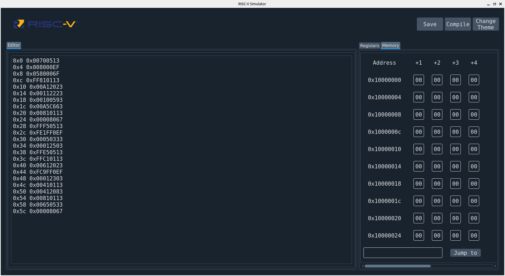

<br />
<p align="center">
    

  <h3 align="center">RISC-V Simulator</h3>

  <p align="center">
    A python implementation of RISC-V Simulation.
    <br />
    <a href="https://github.com/tanmayaeron/CS204_Project_RISC-V"><strong>Explore the docs »</strong></a>
    
  </p>
</p>


<details open="open">
  <summary>Table of Contents</summary>
  <ol>
    <li>
      <a href="#about-the-project">About The Project</a>
      <ul>
        <li><a href="#contributors">Contributors</a></li>
      </ul>
    </li>
    <li>
      <a href="">Getting Started</a>
      <ul>
        <li><a href="#libraries-used">Libraries Used</a></li>
        <li><a href="#installation">Installation</a></li>
      </ul>
    </li>
    <li><a href="#instructions-to-use-gui">Usage</a></li>
  </ol>
</details>


## About The Project


The aim of this project is to simulate the machine level execution of RISC V 32-bit instructions using a high level language. The Project also aims to give updates to the user regarding each step of the execution of the program.
It also returns the final status of the memory and registers as output for the user to analyse the working of their programs thoroughly. The Project currently allows the user to use 29 different instructions and can be extended to allow the use of any number of instructions by editing the .csv files as long as the instructions are supported by 32-bit RISC V ISA.
For each instruction the program gives various updates like IR, PC, decoded instruction, temporary registers like RA, RB, RZ, RY, etc. during each cycle and prints the number of cycles.
The program executes each instruction using five stages as described in the RISC V architecture.


## Getting Started

This is an example of how you may give instructions on setting up your project locally.
To get a local copy up and running follow these simple example steps.

### Prerequisites

This is an example of how to list things you need to use the software and how to install them.
* python (>3.7)
* pip (>21.0.3)

### Libraries Used
#### Back-end - Python3
* <b>pandas: </b> for reading .csv files.
* <b>os: </b> for getting and adding path to certain file locations.
* <b>defaultdict: </b> to make a hash map for memory.
* <b>sys: </b> for reading and editing files with ease.

#### Front-end - Python3
* <b>PyQT5: </b> for the Graphic User Interface.
* <b>qdarkstyle: </b> for dark theme

### Installation

1. Unzip fileName.zip and locate the folder directory using cmd

2. Install required libraries using
   ```sh
   pip install -r requirements.txt
   ```
3. To run the GUI version enter
  ```sh
  python main.py
  ```
4. To run the non-GUI version on the default file
  ```sh
  python main.py 2
  ```
5. To run the non-GUI version on a specific file
  ```sh
  python main.py 2 filename.mc
  ```
  <b>Note:- </b> file should be present in the test directory


### Instructions to use GUI
1. Write the code you wish to run in the editor window. You may copy it from any other location as wel.
2. You may save the file using save button.
3. To run the file, press compile button. Once the code completes execution, a tick sign will be visible on the button.
4. You may use the register and memory tabs to see their current state.

### Input Format
* In text segment, data is word by word while in data segment it is byte by byte.
* Text segment followed by data segment demarcated by '$', each line is of format: "address data".
* Example:
  ```
    0x0 0x00500513
    0x4 0x008000EF
    0x8 0x0440006F
    $
    0x10000000 0x64
  ```
### Output Format
Check the generated folder for details of compilation. It contains:
  * <b>memory.txt: </b> details of memory
  * <b>register.txt: </b> details of registers
  * <b>outputLog.txt: </b> details of changes in temporary registers for each cycle


### ScreenShots
<p align="center">
    
 </p>
<p align="center">
    
 </p>
   
   
### Contributors
* Aditya Agarwal - 2019CSB1064
* Aneeket Mangal - 2019CSB1071
* Fadia Het Rakeshkumar - 2019CSB1084
* Shikhar Soni - 2019CSB1119
* Tanmay Aeron - 2019CSB1124
    
     
 
